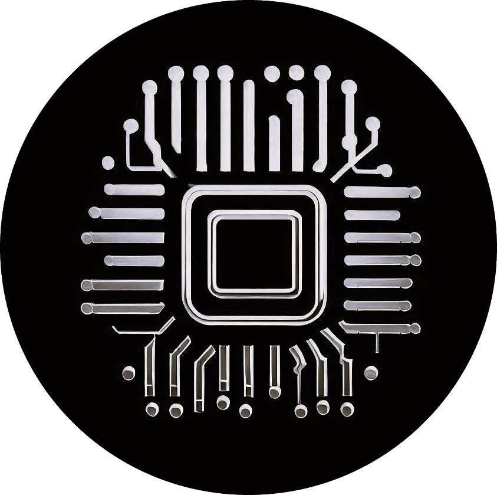

<p align="center">
  
</p>

<h2 align="center">CEmu : The Cheap (Assembly) Emulator</h2>

<p align="center">
  <a href="https://github.com/psf/black"></a>
  <a href="https://github.com/hugsy/cemu/blob/master/LICENSE"></a>
  
  <a href="https://pypi.org/project/cemu/"></a>
  <a href="https://discord.gg/qBn9MbG9vp"></a>
  <a href="https://pepy.tech/project/cemu"></a>
</p>


## Description

Writing assembly is fun. Assembly is the lowest language (humanly understandable) available to communicate with computers, and is crucial to understand the internal mechanisms of any machine. Unfortunately, setting up an environment to write, compile and run assembly for various architectures (x86, ARM, MIPS, SPARC) has always been painful. **CEmu** is an attempt to fix this by providing GUI, CLI and library that allows to write and test assembly quickly.

**CEmu** is built upon:
 * [Keystone](https://github.com/keystone-engine/keystone) for compiling assembly to bytecode
 * [Capstone](https://github.com/aquynh/capstone) for disassembling bytecode
 * [Unicorn](https://github.com/unicorn-engine/unicorn/) for the emulation

And the GUI is powered by in a Qt6.

It allows to test binary samples, check your shellcodes or even simply learn how to write assembly code, all of this for the following architectures:

  - x86-32 / x86-64
  - ARM / AArch64
  - MIPS / MIPS64
  - SPARC / SPARC64
  - PPC (but not emulation)

`CEmu` was mostly tested to work on Linux and Windows, but should work on MacOS.


## Installation ##

__Notes__

Since version 0.2.2, `cemu` is now Python3 only for simplicity and mostly also due to the fact that Python2 is not developed any longer. If your current installation of `cemu` is <= 0.2.1 and on Python2, please uninstall it and install it using Python3.

In addition, Python >= 3.10 is required, starting `0.6`.


### Quick install with PIP ###

Last stable from PyPI:

```bash
pip3 install cemu
```

Last stable from Github:

```bash
git clone https://github.com/hugsy/cemu
cd cemu
pip3 install --upgrade .
```

For 99% of cases, that's all you need to do. `cemu` will be installed in the associated `Scripts` directory:
 * On Linux by default the executable will be found as `/usr/local/bin/cemu` if installed as root, `~/.local/bin/cemu` for non-root
 * On Windows, `%PYTHON_DIR%\Scripts\cemu.exe` if installed with privileges, `%APPDATA%\Python\Python310\Scripts\cemu.exe` if not

## Usage

### As a GUI

After installing with `pip`, simply run the executable, or invoke via Python

```bash
python -m cemu
```

This should produce a GUI similar to this:


### In the terminal

```bash
python -m cemu cli
```

From where you'll end up in a REPL, allowing you to build and run the emulation environment.


### As a Library

```bash
$ python
>>> import cemu
```

Then use the provided API to build and run your environment.

## Contribution ##

`cemu` was created and maintained by myself, [`@_hugsy_`](https://twitter.com/_hugsy_), but kept fresh thanks to [all the contributors](https://github.com/hugsy/cemu/graphs/contributors).

[  ](https://github.com/hugsy/cemu/graphs/contributors)

If you just like the tool, consider dropping on Discord (or Twitter or other) a simple *"thanks"*, it is always very appreciated.
And if you can, consider [sponsoring me](https://github.com/hugsy/sponsors) - it really helps dedicating time and resources to the projects!
